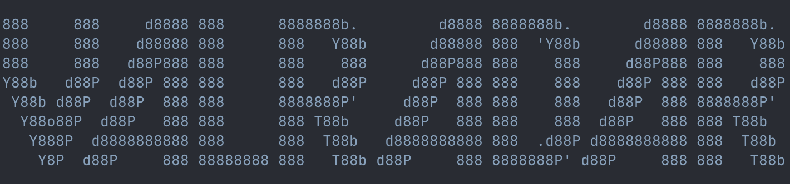

# Valradar

[](https://opensource.org/licenses/MIT)
[](https://neutrino2211.github.io/valradar/)

> [!WARNING]  
> This tool is in early development, although little changes are to be expected proceed with caution.

<p align="center">
    
</p>

Valradar is a high-performance, low-latency, and scalable data processing framework designed for OSINT, RECON and a wide range of operations. It provides a flexible plugin architecture that allows you to create custom data collection and processing pipelines.

https://github.com/user-attachments/assets/512fc378-e189-4bb4-b0db-e40f0e857a17

## Features

- **Plugin-based Architecture**: Create custom data processing plugins in Python
- **High Performance**: Multiprocessing support for parallel data processing
- **State Management**: Built-in support for maintaining state across processing steps
- **Recursive Processing**: Support for depth-based recursive data collection
- **Extensible**: Easy to extend with new plugins and capabilities
- **Command-line Interface**: Simple CLI for running plugins with various options

## 📚 Documentation

**[Read the full documentation →](https://neutrino2211.github.io/valradar/)**

- [Getting Started](https://neutrino2211.github.io/valradar/getting-started.html)
- [Writing Plugins](https://neutrino2211.github.io/valradar/writing-plugins.html)
- [CLI Reference](https://neutrino2211.github.io/valradar/cli-reference.html)
- [API Reference](https://neutrino2211.github.io/valradar/api-reference.html)

## Quick Start

### Installation

```bash
# Build from source
cargo build --release

# Install Python SDK
pip install valradar
```

### Run a Plugin

```bash
# Using the run subcommand (recommended)
valradar run examples.emails https://example.com

# With options
valradar run -c 8 -d 3 examples.emails https://example.com
```

### Create a New Plugin

```bash
valradar new my-plugin
```

## CLI Commands

| Command | Description |
|---------|-------------|
| `valradar run <plugin> [args]` | Run a plugin |
| `valradar new <name>` | Create a new plugin from template |
| `valradar list` | List available plugins |
| `valradar install <plugin>` | Install plugin dependencies |
| `valradar doctor <plugin>` | Validate plugin structure |

### Options

- `-c, --concurrency`: Number of parallel workers (default: 4)
- `-d, --depth`: Recursive processing depth (default: 1)
- `-!, --debug`: Enable debug output
- `-i, --info`: Show plugin information

## Creating Plugins

Valradar uses a class-based SDK for plugin development:

```python
from valradar import Plugin, Context, to_config

class MyPlugin(Plugin):
    name = "my-plugin"
    description = "Does something useful"
    version = "1.0.0"

    def init(self, args: list[str]) -> list[Context]:
        return [Context(url=url) for url in args]

    def collect(self, ctx: Context) -> list[Context]:
        response = ctx.fetch(ctx.get("url"))
        ctx.set("content", response.text)
        return []

    def process(self, ctx: Context) -> dict | None:
        return {"url": ctx.get("url"), "size": len(ctx.get("content", ""))}

plugin = MyPlugin()
VALRADAR_CONFIG = to_config(plugin)
```

See the [Writing Plugins](https://neutrino2211.github.io/valradar/writing-plugins.html) guide for more details.

## Contributing

Contributions are welcome! Please see our [Contributing Guide](https://neutrino2211.github.io/valradar/contributing.html) for details.

## License

This project is licensed under the MIT License - see the [LICENSE](LICENSE) file for details.
